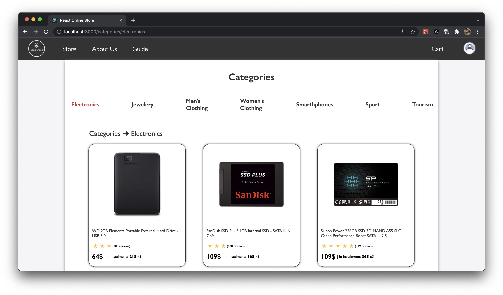
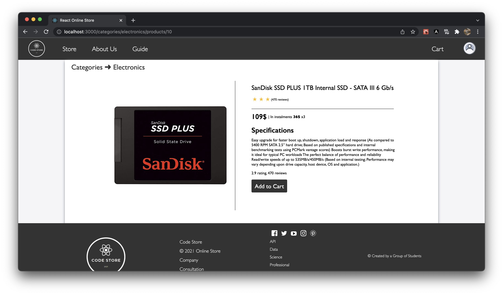
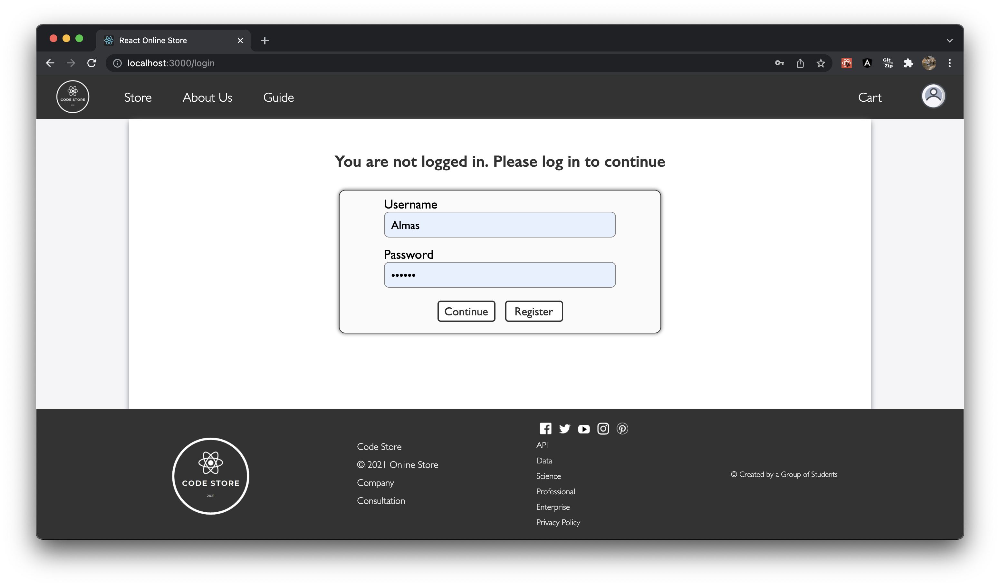
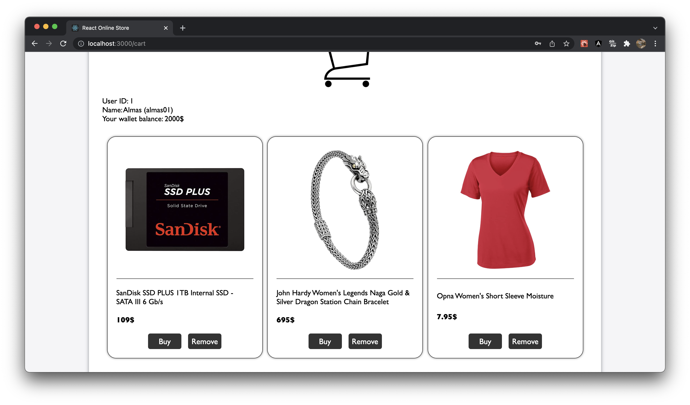
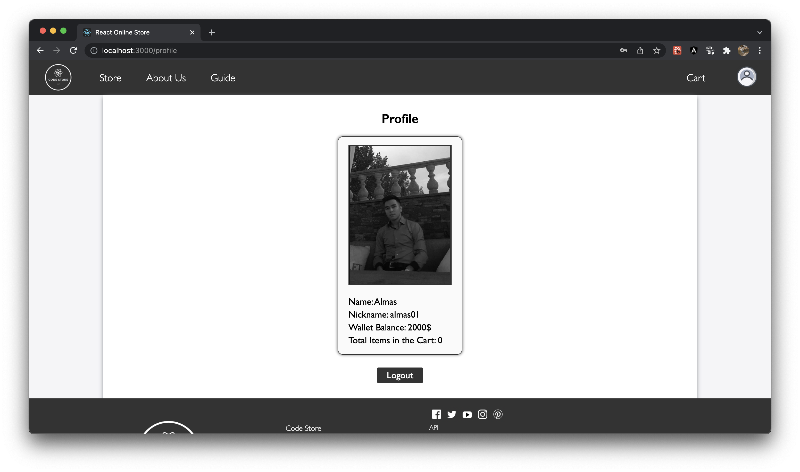

# Final Project For The React Basics Course

During this course, we learned about a new frontend framework called __React__. This project is about an online store website which features __Fake API__ https://fakestoreapi.com/.
***

### Main Features
* Functional components
* React Router and Navigation
* API requests with axios library
* Usage of React Context
* Redux and reducers
* Fake database and fake authentication without real backend
* Usage of hooks like useState, useEffect, useNavigate, useContext, useDispatch, etc.
* Custom hooks
* Optimization with a higher-order component - memo, useMemo and useCallback
***

### Showcase

***

***

***

***
